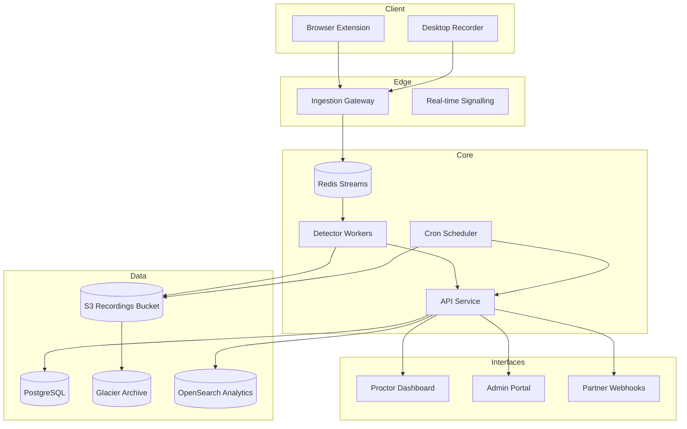

# Architecture & Data Flow

## Table of contents
- [Overview](#overview)
- [Component responsibilities](#component-responsibilities)
- [Recording pipeline](#recording-pipeline)
- [Detection & scoring](#detection--scoring)
- [Storage & retention](#storage--retention)
- [Integrations & external services](#integrations--external-services)
- [Data classification & residency](#data-classification--residency)
- [Observability](#observability)

## Overview
Author is intentionally modular so that each concern (capture, processing, decisioning, and review) can evolve independently. The system is orchestrated via event queues and REST/GraphQL APIs, allowing ingestion spikes to be buffered while downstream services scale horizontally.

- **Client capture**: A browser extension and optional desktop recorder send encrypted streams to the ingestion gateway.
- **Ingestion gateway**: Terminates TLS, enforces consent, and multiplexes streams into Redis Streams.
- **Detector workers**: Python services that pull from Redis, run ML models, and persist scores/flags.
- **API service**: NestJS application that exposes REST + GraphQL endpoints and orchestrates workflows.
- **Dashboard**: React client for proctors and administrators.

## Component responsibilities
| Component | Stack | Responsibilities |
| --- | --- | --- |
| `apps/web` | React + Vite | Proctor UI, session playback, case notes, live chat |
| `apps/api` | Node.js (NestJS) | Auth, exam scheduling, flag lifecycle, REST & GraphQL APIs |
| `services/detector` | Python 3.11 | Video/audio ingestion, ML inference, suspicion scoring |
| `packages/worker-kit` | TypeScript | Shared worker utilities and message schemas |
| `infrastructure/terraform` | Terraform | AWS S3, IAM, VPC, RDS, CloudFront, WAF |
| `jobs/retention` | Node.js cron | Enforces data retention & expunges expired assets |

## Recording pipeline
1. **Session initialization** – The client requests a capture token from the API, which validates consent and exam timing.
2. **Stream multiplexing** – Audio, webcam, and screen frames are streamed via WebRTC; the ingestion gateway writes segments to S3 and publishes metadata to Redis Streams.
3. **Chunk processing** – Workers hydrate segments, run inference (face recognition, object detection, speech classifiers), and attach suspicion metadata.
4. **Flag persistence** – Results are persisted to PostgreSQL and the relevant proctor channel is notified via WebSocket.
5. **Playback assembly** – A background task stitches chunks into HLS playlists stored in S3 for later review.

## Detection & scoring
- **Model management** – Model bundles are versioned in S3. Workers read the `DETECTOR_MODEL_VERSION` environment variable and hot-reload on drift.
- **Score calibration** – Thresholds live in the `detector_thresholds` table and can be tweaked per exam via the Admin Portal.
- **Human-in-the-loop** – Certain event types (e.g., object detection > `0.6` confidence) require manual proctor verification before escalation.
- **Anomaly correlation** – The API aggregates worker events by candidate/session and emits consolidated flags to reduce noise.

## Storage & retention
- **Raw assets** – Stored in S3 with lifecycle policies moving items to Glacier Deep Archive after 30 days.
- **Metadata** – PostgreSQL stores exam, candidate, and flag data; OpenSearch indexes flags and transcripts for search.
- **Retention job** – The `jobs/retention` package deletes recordings past contractual retention while respecting legal holds.
- **Exports** – GDPR exports are generated in temp S3 buckets with time-bounded pre-signed URLs (see [Privacy & Consent Notes](privacy-and-consent.md)).

## Integrations & external services
- **Email/SMS** – Notifications handled via SMTP and Twilio; secrets managed in AWS Secrets Manager.
- **IAM & SSO** – Supports SAML and SCIM provisioning. API enforces RBAC roles (`admin`, `proctor`, `observer`).
- **Partner APIs** – Webhooks deliver flag updates; idempotency keys prevent duplicate processing.

## Data classification & residency
- PII and biometric data remain in the assigned regional S3 bucket (`us-east-1`, `eu-central-1`, or `ap-southeast-2`).
- Metadata replication uses logical decoding with field-level encryption (detector outputs differ per region).
- Consent and retention metadata are stored in dedicated tables to simplify audits.

## Observability
- **Logging** – Structured JSON logs shipped to CloudWatch and aggregated in Datadog.
- **Metrics** – Prometheus scrapes from API and workers; key SLOs include ingestion latency and detection throughput.
- **Tracing** – OpenTelemetry instrumentation covers API requests, queue processing, and storage interactions.
- **Alerting** – PagerDuty incidents trigger when SLOs breach 5-minute windows; see [Operations Runbooks](operations-runbook.md).
